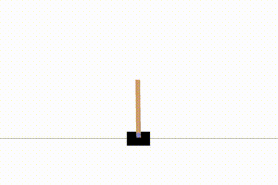

# DQN-PER
### Deep Q-Network (DQN) with Prioritized Experience Replay (PER)

Implementation of a DQN [1] with PER [2] based on Keras.

See [example Notebook](./CartPole-Example.ipynb) using the Gym Environment `CartPole-v1`.

## References

[1] Mnih, Volodymyr, et al. "Human-level control through deep reinforcement learning." _Nature_ 518.7540 (2015): 529.

[2] Schaul, Tom, et al. "Prioritized experience replay." _arXiv preprint_ arXiv:1511.05952 (2015).
